# Beauty E-commerce Backend Architecture

## 1. ERD

```mermaid
erDiagram
    USER ||--o{ ADDRESS : owns
    USER ||--o{ CART : owns
    USER ||--o{ ORDER : places
    CATEGORY ||--o{ CATEGORY : parent_of
    BRAND ||--o{ PRODUCT : brands
    CATEGORY ||--o{ PRODUCT : categorizes
    PRODUCT ||--o| PRODUCT_BEAUTY_PROFILE : has
    PRODUCT ||--o{ PRODUCT_VARIANT : has_real_variants
    ATTRIBUTE ||--o{ ATTRIBUTE_VALUE : has
    PRODUCT_VARIANT ||--o{ VARIANT_ATTRIBUTE_VALUE : selects
    ATTRIBUTE_VALUE ||--o{ VARIANT_ATTRIBUTE_VALUE : used_by
    PRODUCT ||--o{ PRODUCT_IMAGE : gallery
    PRODUCT_VARIANT ||--o{ PRODUCT_IMAGE : variant_gallery
    PRODUCT ||--o{ PRODUCT_CLAIM : has
    CLAIM ||--o{ PRODUCT_CLAIM : audits

    PRODUCT ||--o| STOCK_ITEM : simple_stock_identity
    PRODUCT_VARIANT ||--o| STOCK_ITEM : variable_stock_identity
    STOCK_ITEM ||--o{ PRODUCT_STOCK : warehouse_balance
    WAREHOUSE ||--o{ PRODUCT_STOCK : contains
    STOCK_ITEM ||--o{ STOCK_MOVEMENT : ledger
    STOCK_ITEM ||--o{ STOCK_RESERVATION : reservations

    SUPPLIER ||--o{ PURCHASE : supplies
    WAREHOUSE ||--o{ PURCHASE : receives_into
    PURCHASE ||--o{ PURCHASE_ITEM : contains
    PRODUCT ||--o{ PURCHASE_ITEM : simple_target
    PRODUCT_VARIANT ||--o{ PURCHASE_ITEM : variant_target

    CART ||--o{ CART_ITEM : contains
    PRODUCT ||--o{ CART_ITEM : simple_target
    PRODUCT_VARIANT ||--o{ CART_ITEM : variant_target

    ORDER ||--o{ ORDER_ITEM : snapshots
    PRODUCT ||--o{ ORDER_ITEM : historical_reference
    PRODUCT_VARIANT ||--o{ ORDER_ITEM : optional_reference
    ORDER ||--o{ PAYMENT : payments
    ORDER ||--o{ SHIPMENT : shipments
    ORDER ||--o{ RETURN_REQUEST : returns
    RETURN_REQUEST ||--o{ RETURN_ITEM : contains
    ORDER_ITEM ||--o{ RETURN_ITEM : returned_item
    PAYMENT ||--o{ REFUND : refunded_from

    PRODUCT ||--o{ REVIEW : reviewed
    ORDER_ITEM ||--o{ REVIEW : verifies_purchase
    USER ||--o{ REVIEW : writes
```



### Hard database invariants

- `StockItem`: exactly one of `product`, `variant` is non-null.
- `PurchaseItem`: exactly one of `product`, `product_variant` is non-null.
- `CartItem`: exactly one of `product`, `product_variant` is non-null.
- Simple product stock may only resolve through `StockItem.product`.
- Variable product stock may only resolve through a real `ProductVariant` and `StockItem.variant`.
- `ProductStock(stock_item, warehouse)` is unique.
- Stock quantities are unsigned fields and service operations reject invalid negative outcomes.
- Return quantity cannot exceed purchased quantity.
- Refund allocations cannot exceed the paid amount.

## 2. Simple vs Variable Product Architecture

### Simple product

```text
Product(product_type=simple)
├── sku / barcode
├── base_price / compare_at_price / cost_price
└── StockItem(product=Product, variant=NULL)
```

A simple product has no database-mandated or fake variant. The product is the sellable identity.

### Variable product

```text
Product(product_type=variable)
└── ProductVariant
    ├── sku / barcode
    ├── price_override / cost_price / weight
    ├── AttributeValue(s) through VariantAttributeValue
    └── StockItem(product=NULL, variant=ProductVariant)
```

Publishing rules:

- Simple: SKU required, variants rejected.
- Variable: at least one active real variant is required before publication.
- Attributes are data-driven (`Shade`, `Color`, `Volume`, `Size`, `Finish`, future attributes).

## 3. Stock Architecture

```text
Inventory target
    ↓
StockItem (XOR product/variant)
    ↓
ProductStock per Warehouse
    ├── available_stock
    ├── reserved_stock
    ├── damaged_stock
    └── incoming_stock
    ↓
StockMovement immutable ledger
```

Central service functions:

- `get_sellable_stock()`
- `reserve_stock()`
- `release_stock()`
- `consume_reserved_stock()`
- `increase_stock()`
- `decrease_stock()`
- `adjust_stock()`
- `transfer_stock()`

`StockReservation` records the exact warehouse allocation for each order item. Cancellation and delivery therefore release/consume the same reservation instead of recomputing a warehouse later.

## 4. Order Lifecycle

```text
Pending
  ├── Cancelled
  └── Confirmed
        ├── Cancelled
        └── Processing
              ├── Cancelled
              └── Packed
                    ├── Cancelled
                    └── Ready To Ship
                          ├── Cancelled
                          └── Shipped
                                ↓
                          Out For Delivery
                                ↓
                            Delivered
                                ↓
                         Return Requested
                          ↙            ↘
                Partially Returned   Returned
                          \            /
                              Refunded
```

Stock semantics:

- Checkout: reserve stock.
- Pre-shipment cancellation: release reservation.
- Delivered: consume reserved stock.
- Accepted physical return: increase stock only when marked restockable.

All transitions go through `orders.services.transition_order()`.

## 5. Purchase Lifecycle

```text
Draft → Approved → Partially Received → Received
             └────────────────────────→ Cancelled (before receiving policy)
```

Receive operation:

```text
transaction.atomic
→ lock Purchase
→ lock PurchaseItem rows
→ validate remaining quantity
→ resolve native StockItem
→ lock ProductStock
→ increase stock
→ create PURCHASE StockMovement
→ increment received_quantity
→ recompute purchase status
```

Submitting a receive quantity above the remaining amount is rejected, preventing double-stock.

## 6. API Map

### Public/storefront

| Method | Endpoint | Auth |
|---|---|---|
| GET | `/api/v1/products/` | AllowAny |
| GET | `/api/v1/products/{slug}/` | AllowAny |
| GET | `/api/v1/products/search/` | AllowAny |
| GET | `/api/v1/categories/` | AllowAny |
| GET | `/api/v1/brands/` | AllowAny |
| GET | `/api/v1/reviews/` | AllowAny |
| GET | `/api/v1/cart/` | AllowAny / X-Cart-Token |
| POST | `/api/v1/cart/items/` | AllowAny / X-Cart-Token |
| PATCH/DELETE | `/api/v1/cart/items/{id}/` | AllowAny / X-Cart-Token |
| GET | `/api/v1/shipping-methods/` | AllowAny |
| POST | `/api/v1/coupons/validate/` | AllowAny / cart context |
| POST | `/api/v1/checkout/` | AllowAny / cart context |
| POST | `/api/v1/analytics/events/` | AllowAny |
| GET | `/api/v1/orders/` | JWT |
| GET | `/api/v1/orders/{order_number}/` | JWT |
| POST | `/api/v1/returns/` | JWT |
| GET/POST | `/api/v1/wishlist/` | JWT |

### Auth

| Method | Endpoint |
|---|---|
| POST | `/api/v1/auth/login/` |
| POST | `/api/v1/auth/otp/request/` |
| POST | `/api/v1/auth/otp/verify/` |
| POST | `/api/v1/auth/refresh/` |
| POST | `/api/v1/auth/logout/` |
| GET | `/api/v1/auth/me/` |
| CRUD | `/api/v1/auth/addresses/` |
| POST | `/api/v1/auth/google/` (provider adapter extension point) |

### Management

| Area | Endpoint root |
|---|---|
| Dashboard | `/api/v1/admin/dashboard/` |
| Products | `/api/v1/admin/products/` |
| Variants | `/api/v1/admin/variants/` |
| Categories | `/api/v1/admin/categories/` |
| Brands | `/api/v1/admin/brands/` |
| Images | `/api/v1/admin/images/` |
| Bulk images | `/api/v1/admin/images/bulk-upload/` |
| Inventory | `/api/v1/admin/inventory/` |
| Warehouses | `/api/v1/admin/inventory/warehouses/` |
| Suppliers | `/api/v1/admin/inventory/suppliers/` |
| Purchases | `/api/v1/admin/inventory/purchases/` |
| Transfers | `/api/v1/admin/inventory/transfer/` |
| Orders | `/api/v1/admin/orders/` |
| Invoice | `/api/v1/admin/orders/{order_number}/invoice/` |
| Customers | `/api/v1/admin/customers/` |
| Coupons | `/api/v1/admin/coupons/` |
| Promotions | `/api/v1/admin/promotions/` |
| Payments | `/api/v1/admin/payments/` |
| Shipping | `/api/v1/admin/shipping/` |
| Returns | `/api/v1/admin/returns/` |
| Refunds | `/api/v1/admin/refunds/` |
| Reports | `/api/v1/admin/reports/` or `/api/v1/admin/reports/{report}/` |
| Demo import | `/api/v1/admin/demo/import/` (DEBUG only) |

### Schema/docs

- `/api/schema/`
- `/api/docs/`
- `/api/redoc/`

## 7. RBAC Matrix

`✓` = normal ownership, `R` = read/support visibility, `—` = denied.

| Capability | Super Admin | Admin | Manager | Product Mgr | Inventory Mgr | Order Mgr | Support | Marketing | Finance | Customer |
|---|---:|---:|---:|---:|---:|---:|---:|---:|---:|---:|
| Catalog CRUD | ✓ | ✓ | ✓ | ✓ | — | — | — | — | — | — |
| Publish product | ✓ | ✓ | ✓ | ✓ | — | — | — | — | — | — |
| Inventory/warehouse | ✓ | ✓ | ✓ | — | ✓ | — | — | — | — | — |
| Purchase receive | ✓ | ✓ | ✓ | — | ✓ | — | — | — | — | — |
| Stock transfer/adjust | ✓ | ✓ | ✓ | — | ✓ | — | — | — | — | — |
| Order read | ✓ | ✓ | ✓ | — | — | ✓ | R | — | — | own |
| Order transition | ✓ | ✓ | ✓ | — | — | ✓ | — | — | — | — |
| Customer read/support | ✓ | ✓ | ✓ | — | — | — | ✓ | — | — | self |
| Return management | ✓ | ✓ | ✓ | — | — | ✓ | ✓ | — | — | request own |
| Coupon/promotion CRUD | ✓ | ✓ | ✓ | — | — | — | — | ✓ | — | validate only |
| Payment read | ✓ | ✓ | ✓ | — | — | — | — | — | ✓ | own order summary |
| Refund create/complete | ✓ | ✓ | ✓ | — | — | — | — | — | ✓ | — |
| Reports | ✓ | ✓ | ✓ | scoped | scoped | scoped | — | scoped | scoped | — |
| Demo import | ✓ | ✓ | — | — | — | — | — | — | — | — |

## API response envelope

Success:

```json
{"success": true, "message": "Success.", "data": {}}
```

Error:

```json
{"success": false, "message": "Validation failed.", "errors": {}}
```

DRF field-level error objects are preserved inside `errors`.
